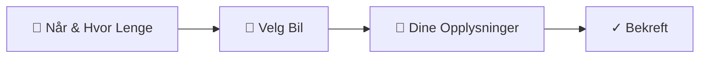

# Bookingflyt

Bookingsystemet har en 4-trinns flyt optimalisert for enkelhet og brukervennlighet.

## Oversikt



## Steg 1: Når & Hvor Lenge

**Formål:** Velg dato, tid og varighet

### Funksjonalitet

- **Datovelger** med dagens dato som standard
- **Tidsvelger** med 15-minutters intervaller
- **Varighet:** Visuell velger for 9 eller 18 hull
- **Prisforhåndsvisning** for medlemmer og gjester

### Validering

- Dato må være i dag eller fremover
- Tidspunkt må velges
- Varighet må velges (9 eller 18 hull)

### UI-elementer

```tsx
// Hole selector cards
<div className="hole-selector">
  <button className="hole-card">
    <div className="hole-number">9</div>
    <div className="hole-label">hull</div>
    <div className="price-preview">
      <span>Medlem: 150 kr</span>
      <span>Gjest: 200 kr</span>
    </div>
  </button>
  <button className="hole-card">
    <div className="hole-number">18</div>
    <div className="hole-label">hull</div>
    <div className="price-preview">
      <span>Medlem: 250 kr</span>
      <span>Gjest: 350 kr</span>
    </div>
  </button>
</div>
```

## Steg 2: Velg Bil

**Formål:** Velg en ledig golfbil

### Funksjonalitet

- **Visuelt rutenett** med alle golfbiler
- **Statusvisning** (Ledig/Opptatt/Ute av drift)
- **Filter** for kun ledige biler
- **Antall ledige** vises øverst

### Status-indikatorer

| Status | Ikon | Tilgjengelig |
|--------|------|--------------|
| Ledig | 🚗 (grønn) | ✅ |
| Opptatt | 🚗 (rød) | ❌ |
| Ute av drift | 🚗 (grå) | ❌ |

### Validering

- Minst én bil må velges
- Kun ledige biler kan velges

### UI-elementer

```tsx
// Cart grid with status
<div className="cart-grid">
  {carts.map(cart => (
    <button className={`cart-card ${cart.status}`}>
      <div className="cart-icon">🚗</div>
      <h3 className="cart-name">{cart.name}</h3>
      <div className="cart-status">
        {getStatusText(cart.status)}
      </div>
    </button>
  ))}
</div>
```

## Steg 3: Dine Opplysninger

**Formål:** Samle kundeinfo og bekrefte pris

### Funksjonalitet

- **Navn** (påkrevd)
- **Medlemsstatus** med medlemsnummer
- **Legeerklæring** (gir 50 kr rabatt)
- **Kontaktvalg:** E-post eller SMS
- **Live prisberegning** med oppdatering ved endringer

### Prisberegning

```typescript
// Base price calculation
const basePrice = isMember ? PRICES.member[holes] : PRICES.nonMember[holes];
const discount = hasDoctorsNote ? DOCTOR_NOTE_DISCOUNT : 0;
const finalPrice = basePrice - discount;
```

| Kategori | 9 hull | 18 hull |
|----------|--------|---------|
| Medlem | 150 kr | 250 kr |
| Gjest | 200 kr | 350 kr |
| Rabatt (legeerklæring) | -50 kr | -50 kr |

### Validering

- Navn må fylles ut
- Hvis medlem: medlemsnummer påkrevd
- Kontaktinfo (e-post eller telefon) påkrevd

### UI-elementer

```tsx
// Price breakdown card
<div className="price-breakdown-card">
  <h3>💰 Prissammendrag</h3>
  <div className="price-row">
    <span>Basispris ({holes} hull)</span>
    <span>{basePrice} kr</span>
  </div>
  {hasDoctorsNote && (
    <div className="price-row discount">
      <span>Rabatt (legeerklæring)</span>
      <span>-{discount} kr</span>
    </div>
  )}
  <div className="price-row total">
    <span>Totalt å betale</span>
    <span>{finalPrice} kr</span>
  </div>
</div>
```

## Steg 4: Bekreft Bestilling

**Formål:** Gjennomgå og bekrefte bookingen

### Funksjonalitet

- **Sammendrag** av alle valg
- **Redigeringsknapper** for hvert steg
- **Vilkår og betingelser** (må aksepteres)
- **Prissammendrag** med gradient-design
- **Bekreftelseskjerm** etter vellykket booking

### Sammendragseksjoner

1. **📅 Tidspunkt & Bil**
   - Dato og klokkeslett
   - Valgt golfbil
   - Antall hull

2. **👤 Dine Opplysninger**
   - Navn
   - Kontaktinfo
   - Medlemsstatus
   - Eventuelle rabatter

3. **💰 Prissammendrag**
   - Basispris
   - Rabatter
   - Totalbeløp
   - Betalingsinfo

### Bekreftelsesflyt

```typescript
const handleConfirm = async () => {
  // 1. Validate terms acceptance
  if (!termsAccepted) return;
  
  // 2. Create rental in Firestore
  await createRental({
    cartId: data.cartId,
    renterName: data.name,
    isMember: data.isMember,
    price: finalPrice,
    // ... other fields
  });
  
  // 3. Show success screen
  setIsSuccess(true);
};
```

### Suksessskjerm

Etter vellykket booking vises:

- 🎉 **Bekreftelsesikon**
- **Bookingdetaljer** (bil, tid, varighet)
- **E-post/SMS-bekreftelse** sendt til kunden
- **Knapp** for ny booking

## Navigasjon

### Fremover-navigasjon

- ✅ Alle påkrevde felt må være utfylt
- ✅ Validering må bestå
- Klikk "Neste" eller "Fortsett"

### Tilbake-navigasjon

- Klikk "Tilbake"-knapp
- Klikk på tidligere steg i fremdriftsindikatoren
- Data bevares ved navigering

### Fremdriftsindikator

```tsx
<ProgressSteps currentStep={currentStep} totalSteps={4} onStepClick={goToStep}>
  <Step number={1} title="Når & Hvor Lenge" icon="📅" />
  <Step number={2} title="Velg Bil" icon="🚗" />
  <Step number={3} title="Dine Opplysninger" icon="📝" />
  <Step number={4} title="Bekreft" icon="✓" />
</ProgressSteps>
```

### Animasjoner

- **Pulsering** på gjeldende steg
- **Grønn fylling** for fullførte steg
- **Fremgangsbar** under stegene
- **Hover-effekter** på klikkbare elementer

## Responsivt Design

### Desktop (>768px)

- Rutenett med flere kolonner for golfbiler
- Side-ved-side-layout for skjemafelt
- Full bredde på priskort

### Mobil (<768px)

- Enkel kolonne for golfbiler
- Stablede skjemafelt
- Kompakt fremdriftsindikator
- Full bredde på knapper

## Feilhåndtering

### Valideringsfeil

```tsx
{error && (
  <div className="error-message">
    ⚠️ {error}
  </div>
)}
```

### Nettverksfeil

```tsx
try {
  await createRental(data);
} catch (error) {
  console.error('Booking failed:', error);
  alert('Kunne ikke fullføre booking. Prøv igjen.');
}
```

## Tilgjengelighet

- **ARIA-labels** på alle interaktive elementer
- **Tastaturnavigasjon** støttes fullt ut
- **Fokusstyring** ved stegendringer
- **Skjermleservennlig** status-meldinger
- **Kontrastforhold** følger WCAG 2.1 AA

## Prestasjonsoptimalisering

- **Lazy loading** av stegkomponenter
- **Memoization** av prisberegninger
- **Debouncing** på sanntidsvalidering
- **Optimistisk UI** for rask respons

## Testing

### Unit tests

```typescript
describe('BookingStepper', () => {
  it('validates step 1 before proceeding', () => {
    // Test date, time, holes validation
  });
  
  it('calculates price correctly', () => {
    // Test price calculation with all scenarios
  });
  
  it('creates rental on confirmation', () => {
    // Test Firestore integration
  });
});
```

### E2E tests

- Full bookingflyt fra start til slutt
- Navigering frem og tilbake mellom steg
- Validering på hvert steg
- Vellykket booking med ulike scenarioer
