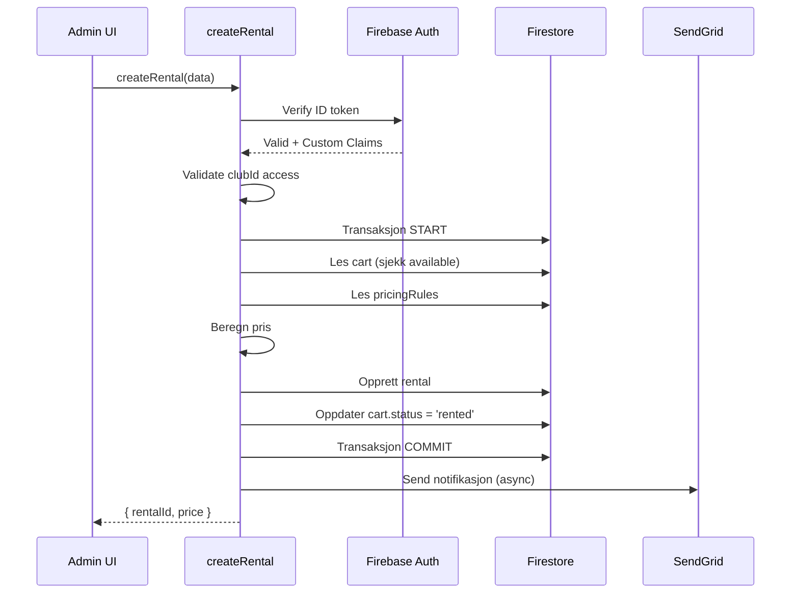

# API Oversikt

GolfChart eksponerer et sett med Cloud Functions for å håndtere backend-logikk som krever server-side validering, transaksjoner, og integrasjoner med eksterne tjenester.

## Tilgjengelige endpoints

| Funksjon | Beskrivelse | Autentisering | Roller |
|----------|-------------|---------------|--------|
| `createRental` | Opprett ny utleie | ✅ | staff, clubAdmin, superadmin |
| `endRental` | Avslutt pågående utleie | ✅ | staff, clubAdmin, superadmin |
| `updateCartStatus` | Endre cart status | ✅ | staff, clubAdmin, superadmin |
| `sendNotification` | Send e-post/SMS | ✅ | staff, clubAdmin, superadmin |
| `generateReport` | Generer rapport (scheduled) | ❌ | N/A (cron) |
| `setUserRole` | Sett brukerrolle | ✅ | superadmin |

## Base URL

**Produksjon:**

```
https://europe-west1-golfbilkontroll-skigk.cloudfunctions.net
```

**Emulator (lokal):**

```
http://localhost:5001/golfbilkontroll-skigk/europe-west1
```

## Autentisering

Alle callable functions krever Firebase Auth ID token:

```typescript
// admin/src/api/client.ts
import { getFunctions, httpsCallable } from 'firebase/functions';
import { getAuth } from 'firebase/auth';

const functions = getFunctions(app, 'europe-west1');

export async function callFunction<T>(name: string, data: any): Promise<T> {
  const auth = getAuth();
  const user = auth.currentUser;
  
  if (!user) {
    throw new Error('Ikke innlogget');
  }
  
  const fn = httpsCallable<any, T>(functions, name);
  const result = await fn(data);
  return result.data;
}
```

## Feilhåndtering

Functions returnerer standard Firebase `HttpsError` ved feil:

```typescript
// Eksempel respons ved feil
{
  "code": "permission-denied",
  "message": "Ikke tilgang til denne klubben",
  "details": {
    "clubId": "ski-gk",
    "userClubs": ["holmenkollen-gk"]
  }
}
```

**Feilkoder:**

| Kode | Betydning |
|------|-----------|
| `unauthenticated` | Bruker er ikke innlogget |
| `permission-denied` | Mangler nødvendig rolle eller klubbtilgang |
| `invalid-argument` | Ugyldig input-data |
| `not-found` | Ressurs ikke funnet |
| `already-exists` | Ressurs eksisterer allerede |
| `resource-exhausted` | Rate limit overskredet |
| `internal` | Intern serverfeil |

## Rate limiting

App Check er aktivert for alle functions:

```typescript
export const myFunction = onCall(
  {
    enforceAppCheck: true,
    consumeAppCheckToken: true
  },
  async (data, context) => {
    // Handler
  }
);
```

**Grenser:**

- Standard: 100 requests/min per IP
- Authenticated: 1000 requests/min per bruker

## Eksempel: createRental

### Request

```typescript
import { callFunction } from '@/api/client';

const result = await callFunction<{ rentalId: string; price: number }>('createRental', {
  clubId: 'ski-gk',
  cartId: 'cart123',
  renterName: 'Ola Nordmann',
  membershipNumber: '73-12345',
  hasDoctorsNote: false,
  holes: 18,
  paymentMethod: 'Kort',
  notificationMethod: 'email',
  contactInfo: 'ola@example.com',
  notes: 'Forhåndsbooket'
});

console.log(`Rental ${result.rentalId} opprettet, pris: ${result.price} kr`);
```

### Response

```json
{
  "rentalId": "rental_20251203_001",
  "price": 350,
  "startTime": "2025-12-03T10:00:00.000Z"
}
```

### Flow



## Testing

### Lokal testing (Emulator)

```typescript
// admin/src/firebase.ts
import { connectFunctionsEmulator } from 'firebase/functions';

if (import.meta.env.VITE_USE_EMULATOR === 'true') {
  connectFunctionsEmulator(functions, 'localhost', 5001);
}
```

### Integration tests

```typescript
// tests/functions.test.ts
import { wrap } from 'firebase-functions-test';

const testEnv = wrap();

describe('createRental', () => {
  it('should create rental and update cart', async () => {
    const data = {
      clubId: 'ski-gk',
      cartId: 'cart123',
      renterName: 'Test User',
      holes: 18
    };
    
    const context = {
      auth: {
        uid: 'user123',
        token: {
          role: 'staff',
          clubs: ['ski-gk']
        }
      }
    };
    
    const result = await createRental(data, context);
    
    expect(result.rentalId).toBeDefined();
    expect(result.price).toBe(350);
  });
});
```

## Best practices

### ✅ Do:

- Alltid valider input i functions
- Bruk transaksjoner for multi-step operasjoner
- Logg alle kritiske operasjoner
- Håndter race conditions (f.eks. to utleier på samme cart samtidig)
- Bruk structured logging

### ❌ Don't:

- Ikke stol på frontend-validering alene
- Ikke gjør tunge operasjoner i functions (cold start)
- Ikke returner sensitive data i error messages
- Ikke glem å validere clubId-tilgang

## Neste steg

- [Auth API](auth.md) — Autentisering og brukeradministrasjon
- [Firestore API](firestore.md) — Direkte Firestore queries
- [Functions API](functions.md) — Detaljert dokumentasjon per function
