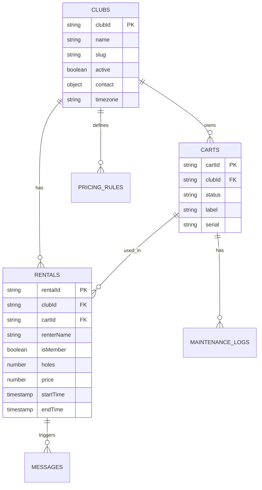

# Datamodell

GolfChart bruker Firestore med en multi-klubb arkitektur hvor alle dokumenter er tagget med `clubId` for dataisolasjon.

## Oversikt



## Kolleksjoner

### clubs

Basisinformasjon om hver golfklubb.

**Dokument-ID:** Manuelt satt slug (f.eks. `ski-gk`)

```typescript
interface Club {
  name: string;              // "Ski Golfklubb"
  slug: string;              // "ski-gk" (samme som doc ID)
  active: boolean;           // Er klubben aktiv?
  contact: {
    email: string;
    phone: string;
    address?: string;
  };
  timezone: string;          // "Europe/Oslo"
  createdAt: Timestamp;
  updatedAt: Timestamp;
}
```

**Eksempel:**

```json
{
  "name": "Ski Golfklubb",
  "slug": "ski-gk",
  "active": true,
  "contact": {
    "email": "postkasse@skigk.no",
    "phone": "+47 64 88 99 42"
  },
  "timezone": "Europe/Oslo",
  "createdAt": "2025-11-17T10:00:00.000Z",
  "updatedAt": "2025-11-17T10:00:00.000Z"
}
```

### pricingRules

Prisregler per klubb for medlemmer/ikke-medlemmer og 9/18 hull.

**Dokument-ID:** Auto-generert eller `{clubId}_default`

```typescript
interface PricingRule {
  clubId: string;            // FK til clubs
  holes18: {
    member: number;          // 350
    nonMember: number;       // 425
  };
  holes9: {
    member: number;          // 200
    nonMember: number;       // 250
  };
  doctorsNoteDiscount: number; // 50
  effectiveFrom: Timestamp;
  effectiveTo?: Timestamp;   // null = aktiv
}
```

**Eksempel:**

```json
{
  "clubId": "ski-gk",
  "holes18": {
    "member": 350,
    "nonMember": 425
  },
  "holes9": {
    "member": 200,
    "nonMember": 250
  },
  "doctorsNoteDiscount": 50,
  "effectiveFrom": "2025-01-01T00:00:00.000Z",
  "effectiveTo": null
}
```

### carts

Golfbiler tilhørende en klubb.

**Dokument-ID:** Auto-generert eller `{clubId}_cart_{n}`

```typescript
type CartStatus = 'available' | 'rented' | 'out_of_order';

interface Cart {
  clubId: string;            // FK til clubs
  status: CartStatus;
  label: string;             // "Bil 1", "Bil 2"
  serial?: string;           // Serienummer
  notes?: string;
  currentRentalId?: string;  // FK til aktiv rental (hvis rented)
  createdAt: Timestamp;
  updatedAt: Timestamp;
}
```

**Eksempel:**

```json
{
  "clubId": "ski-gk",
  "status": "available",
  "label": "Bil 1",
  "serial": "GOLF-2023-001",
  "notes": "",
  "currentRentalId": null,
  "createdAt": "2025-11-17T10:00:00.000Z",
  "updatedAt": "2025-12-03T14:30:00.000Z"
}
```

### rentals

Utleietransaksjoner (både aktive og historiske).

**Dokument-ID:** Auto-generert timestamp-basert

```typescript
interface Rental {
  clubId: string;            // FK til clubs
  cartId: string;            // FK til carts
  renterName: string;
  membershipNumber?: string; // "73-12345"
  isMember: boolean;         // Beregnet fra membershipNumber
  hasDoctorsNote: boolean;
  holes: 9 | 18;
  price: number;             // Beregnet pris
  paymentMethod?: string;    // "Kort", "Vipps", "Kontant"
  startTime: Timestamp;
  endTime?: Timestamp;       // null = pågående
  notificationMethod?: 'email' | 'sms';
  contactInfo?: string;      // E-post eller telefon
  reminderSent: boolean;
  notes?: string;
  createdAt: Timestamp;
  updatedAt: Timestamp;
}
```

**Eksempel:**

```json
{
  "clubId": "ski-gk",
  "cartId": "ski-gk_cart_1",
  "renterName": "Ola Nordmann",
  "membershipNumber": "73-12345",
  "isMember": true,
  "hasDoctorsNote": false,
  "holes": 18,
  "price": 350,
  "paymentMethod": "Kort",
  "startTime": "2025-12-03T09:00:00.000Z",
  "endTime": null,
  "notificationMethod": "email",
  "contactInfo": "ola@example.com",
  "reminderSent": false,
  "notes": "Forhåndsbooket online",
  "createdAt": "2025-12-03T08:45:00.000Z",
  "updatedAt": "2025-12-03T08:45:00.000Z"
}
```

### maintenanceLogs

Vedlikeholdslogg når biler settes ute av drift eller repareres.

**Dokument-ID:** Auto-generert

```typescript
interface MaintenanceLog {
  clubId: string;
  cartId: string;
  statusBefore: CartStatus;
  statusAfter: CartStatus;
  reason: string;
  byUser: string;           // UID til bruker som gjorde endringen
  timestamp: Timestamp;
}
```

**Eksempel:**

```json
{
  "clubId": "ski-gk",
  "cartId": "ski-gk_cart_2",
  "statusBefore": "available",
  "statusAfter": "out_of_order",
  "reason": "Bremsefeil - sendt til verksted",
  "byUser": "user_abc123",
  "timestamp": "2025-12-03T10:15:00.000Z"
}
```

### users

Brukerprofiler (speiler Firebase Auth).

**Dokument-ID:** Samme som Firebase Auth UID

```typescript
interface User {
  email: string;
  displayName?: string;
  clubs: string[];          // Liste av clubIds brukeren har tilgang til
  roles: string[];          // Lokal kopi av custom claims
  createdAt: Timestamp;
  lastLogin?: Timestamp;
}
```

**Eksempel:**

```json
{
  "email": "admin@skigk.no",
  "displayName": "Admin Bruker",
  "clubs": ["ski-gk"],
  "roles": ["clubAdmin"],
  "createdAt": "2025-11-17T10:00:00.000Z",
  "lastLogin": "2025-12-03T08:00:00.000Z"
}
```

### messages

Logg over sendte varsler (e-post/SMS).

**Dokument-ID:** Auto-generert

```typescript
type MessageStatus = 'pending' | 'sent' | 'failed';

interface Message {
  clubId: string;
  method: 'email' | 'sms';
  to: string;
  templateId?: string;
  body?: string;
  status: MessageStatus;
  retries: number;
  error?: string;
  sentAt?: Timestamp;
  createdAt: Timestamp;
}
```

### reports

Genererte rapporter og eksporter.

**Dokument-ID:** Auto-generert

```typescript
interface Report {
  clubId: string;
  type: 'rentals' | 'revenue' | 'maintenance';
  range: {
    from: Timestamp;
    to: Timestamp;
  };
  status: 'generating' | 'completed' | 'failed';
  storagePath?: string;     // Sti til CSV/JSON i Storage
  createdAt: Timestamp;
  completedAt?: Timestamp;
}
```

## Indekser

Firestore krever indekser for sammensatte queries:

### rentals

```json
{
  "collectionGroup": "rentals",
  "queryScope": "COLLECTION",
  "fields": [
    { "fieldPath": "clubId", "order": "ASCENDING" },
    { "fieldPath": "startTime", "order": "DESCENDING" }
  ]
}
```

### carts

```json
{
  "collectionGroup": "carts",
  "queryScope": "COLLECTION",
  "fields": [
    { "fieldPath": "clubId", "order": "ASCENDING" },
    { "fieldPath": "status", "order": "ASCENDING" }
  ]
}
```

### maintenanceLogs

```json
{
  "collectionGroup": "maintenanceLogs",
  "queryScope": "COLLECTION",
  "fields": [
    { "fieldPath": "cartId", "order": "ASCENDING" },
    { "fieldPath": "timestamp", "order": "DESCENDING" }
  ]
}
```

Disse er definert i `firestore.indexes.json` og deployes med:

```pwsh
firebase deploy --only firestore:indexes
```

## Transaksjoner

Kritiske operasjoner bruker Firestore-transaksjoner:

### createRental

1. Les cart for å sjekke status
2. Les pricingRules for å beregne pris
3. Opprett rental-dokument
4. Oppdater cart.status til 'rented' og sett currentRentalId

### endRental

1. Les rental-dokument
2. Sett rental.endTime
3. Oppdater cart.status til 'available' og fjern currentRentalId

## Neste steg

- [Sikkerhetsmodell](security.md) — Firestore security rules
- [API referanse](../api/firestore.md) — Query-patterns og beste praksis
- [Multi-klubb design](multi-tenant.md) — Isolasjon og skalering
