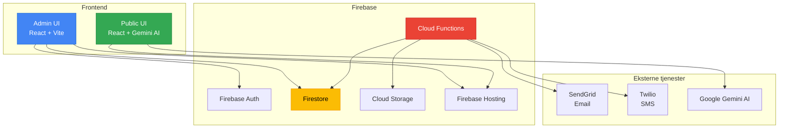
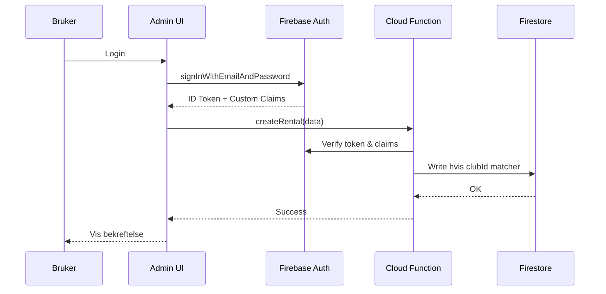
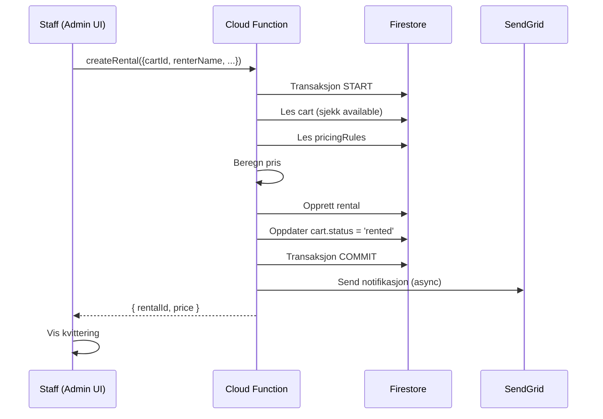
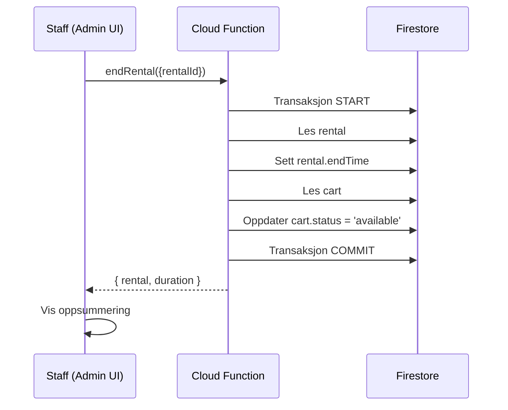

# Systemarkitektur

GolfChart er bygget med Firebase som backend og moderne React frontend, designet for multi-klubb bruk med sterk dataisolasjon.

## Overordnet arkitektur



## Arkitektoniske beslutninger

### 1. Multi-tenancy modell

**Beslutning:** Shared database med clubId-basert isolasjon

**Rationale:**

- Enklere vedlikehold enn separate Firebase-prosjekter per klubb
- Kostnadseffektivt for små klubber
- Sentralisert overvåkning og backup

**Implikasjoner:**

- Security rules må strengt håndheve clubId-filtrering
- Alle queries må inkludere clubId
- Custom claims brukes for rollebasert tilgang

### 2. Frontend separasjon

**Beslutning:** To separate React-apper (Admin vs Public)

**Rationale:**

- Admin UI krever autentisering og kompleks state management
- Public UI er enkel, fokusert på AI-assistenten "Golfy"
- Muliggjør uavhengige deploy-cycles

**Deployment:**

```
firebase.json:
  hosting:
    - public: admin/dist     # Admin UI på /admin
    - public: public/dist    # Public UI på /
```

### 3. Cloud Functions role

**Beslutning:** Minimal server-side logic, mest i frontend

**Rationale:**

- Reduserer cold-start latens
- Enklere debugging i browser
- Functions reservert for:
  - Sensitivt prisberegning
  - Notifikasjonsutsending
  - Batch jobs (rapporter)

**Kritiske Functions:**

```typescript
// functions/src/index.ts
exports.createRental = onCall(async (data, context) => {
  // Validering av clubId tilgang
  // Transaksjon: cart + rental + price calculation
});

exports.sendNotification = onCall(async (data, context) => {
  // SendGrid/Twilio integration
});

exports.generateReport = onSchedule('0 2 * * 1', async (context) => {
  // Ukentlige rapporter til Storage
});
```

### 4. Auth strategi

**Beslutning:** Firebase Auth med custom claims for roller

**Roller:**

```typescript
interface CustomClaims {
  role: 'superadmin' | 'clubAdmin' | 'staff' | 'viewer';
  clubs: string[];  // Liste av clubIds brukeren har tilgang til
}
```

**Flow:**



### 5. Real-time vs Batch

**Beslutning:** Real-time for cart status, batch for rapporter

**Real-time (Firestore listeners):**

- Cart availability i Admin UI
- Aktive rentals
- Maintenancelogger

**Batch (Scheduled Functions):**

- Daglige inntektsrapporter
- Ukentlige CSVer
- Månedlige statistikk-e-poster

## Dataflyt

### Utleie-flow



### Innlevering-flow



## Feilhåndtering

### Retry-strategi

**Cloud Functions:**

```typescript
// functions/src/utils/retry.ts
export async function retryOperation<T>(
  operation: () => Promise<T>,
  maxRetries = 3,
  delayMs = 1000
): Promise<T> {
  for (let i = 0; i < maxRetries; i++) {
    try {
      return await operation();
    } catch (error) {
      if (i === maxRetries - 1) throw error;
      await new Promise(resolve => setTimeout(resolve, delayMs * (i + 1)));
    }
  }
  throw new Error('Max retries reached');
}
```

**Frontend:**

```typescript
// admin/src/hooks/useFirestore.ts
const { data, error, retry } = useFirestoreQuery({
  collection: 'rentals',
  where: [['clubId', '==', currentClub]],
  orderBy: [['startTime', 'desc']],
  limit: 50,
  retryOnError: true,
  retryCount: 3
});
```

### Offline-håndtering

Firebase Firestore SDK har innebygd offline-støtte:

```typescript
// admin/src/firebase.ts
const db = getFirestore(app);
enableMultiTabIndexedDbPersistence(db).catch((err) => {
  if (err.code === 'failed-precondition') {
    console.warn('Persistence ikke tilgjengelig i flere tabs');
  } else if (err.code === 'unimplemented') {
    console.warn('Browser støtter ikke persistence');
  }
});
```

## Skaleringsplan

### Fase 1 (MVP): 1-5 klubber

- Single Firebase project
- europe-west1 region
- Standard pricing

### Fase 2: 5-20 klubber

- Sharding vurderes (men trolig ikke nødvendig)
- Oppgrader til Blaze plan for bedre support
- CDN for statiske assets

### Fase 3: 20+ klubber

- Multi-region deployment vurderes
- Dedikerte Cloud Functions per klubb-group
- Analytics og monitoring med Datadog/New Relic

## Sikkerhet

Se [Sikkerhetsmodell](security.md) for detaljer om:

- Firestore Security Rules
- Custom Claims validering
- CORS-konfigur asjon
- Secrets management

## Neste steg

- [Datamodell](data-model.md) — Firestore kolleksjoner og struktur
- [Multi-tenancy](multi-tenant.md) — ClubId-isolasjon i praksis
- [API dokumentasjon](../api/overview.md) — Cloud Functions og endpoints
